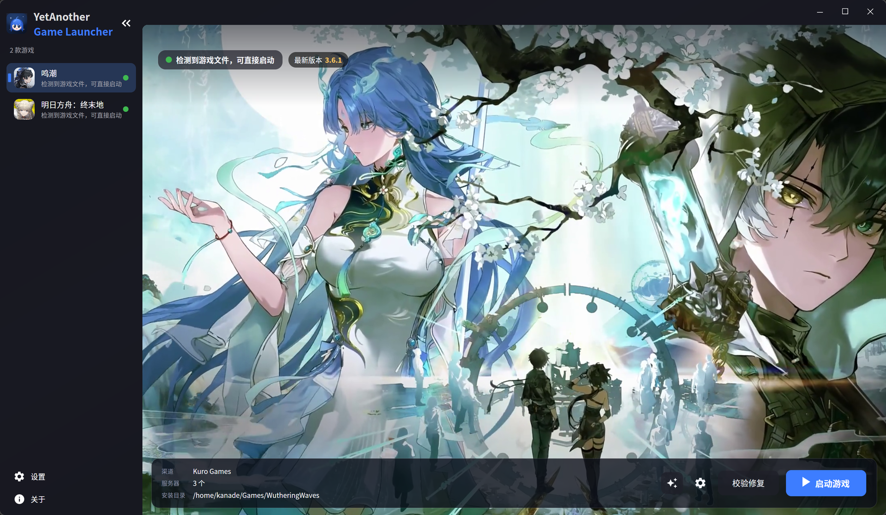
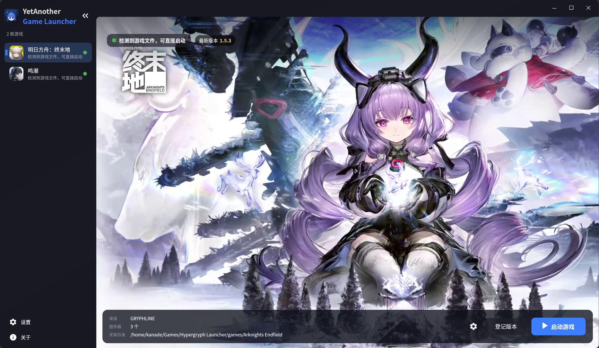
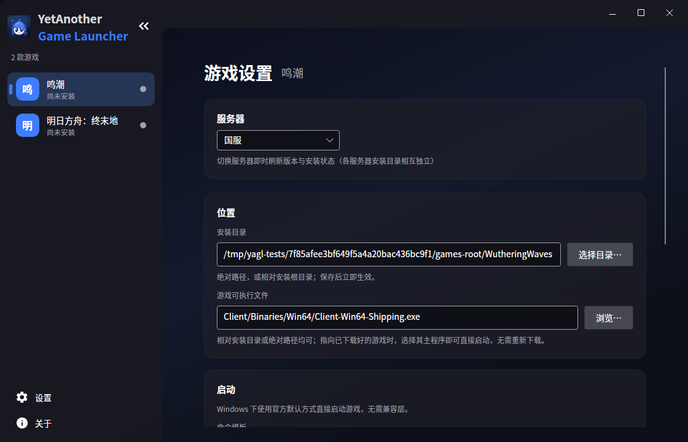
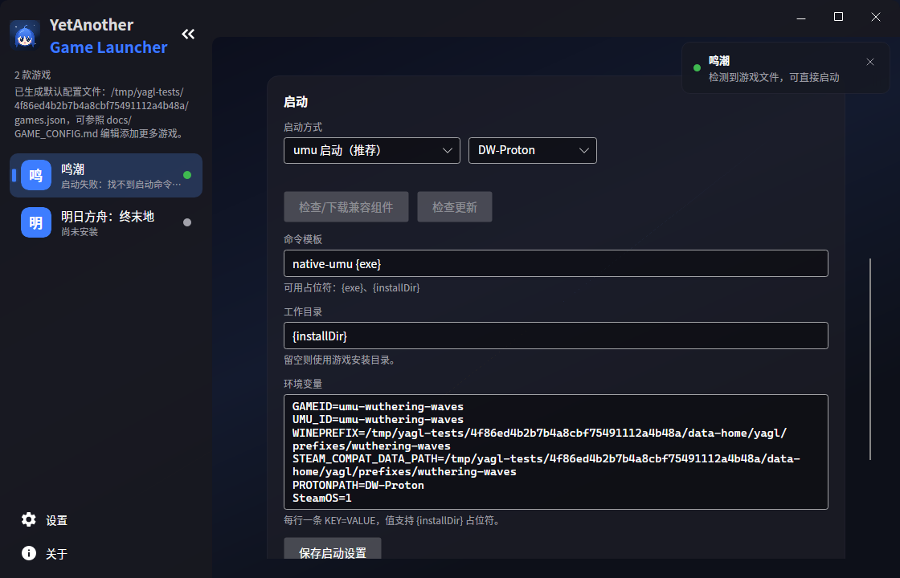
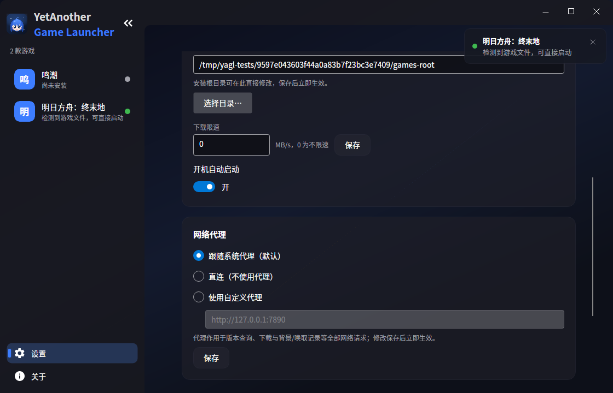

# YetAnotherGameLauncher

<div align="center">



**一个为 Linux 与 Windows 桌面设计的开源游戏启动器**

基于 .NET 10 + Avalonia 12 + MVVM，游戏本体通过配置文件驱动，代码不内置任何具体游戏。

[](https://github.com/AngelBeats-Kanade/YetAnotherGameLauncher/actions/workflows/ci.yml)
[](LICENSE)


**简体中文** | [English](README.en.md)

</div>

当前支持：

- 《鸣潮》（库洛官方启动器协议，支持 国服 / B服 / 国际服）
- 《明日方舟：终末地》（GRYPHLINE / 鹰角启动器协议，支持 国服 / 国际服 / B服）

> [!NOTE]
> 《鸣潮》《明日方舟：终末地》均为 Windows 程序，在 Linux 上运行依赖 **wine / Proton**。
> 本启动器不代管 wine，而是通过启动命令模板（见 [GAME_CONFIG.md](docs/GAME_CONFIG.md)）支持任意包装方式——
> 默认的 umu 启动链甚至会自动帮你装好 Proton，见下文。

## ✨ 核心特性

- 🎮 **一键启动** — 命令模板 `{exe}` / `{installDir}` 占位符 + 环境变量注入；启动预检给出类目化中文错误，游戏输出落盘启动日志，失败弹主题化错误卡（含打开日志目录）
- 🐧 **Linux 原生 umu 启动链** — 无需外部 umu-run：按 Proton 的 toolmanifest 自动下载 Proton 与 Steam Runtime 并搭建容器与 prefix；DW-Proton（默认）/ GE-Proton / UMU-Proton 发行版可选，**选择即保存**，下载资产按主机架构（x86_64/aarch64）匹配；发行版带「检查更新」，确认后升级并自动清理旧目录
- ⬇️ **全量下载 + 断点续传** — 官方清单逐文件同步（鸣潮）/ 压缩包整包解压（终末地），size+MD5 双校验；`.temp` 临时文件 + HTTP Range 续传，瞬态网络错误线性退避重试，下载限速可调
- 🩹 **增量更新 + 预下载** — 鸣潮走官方 krpdiff 差分包，调用原生 `hpatchz`（HDiffPatch）合成，`.yagl-bak` 备份回滚；两段式预更新先暂存后一键应用；包式渠道检测到本机已装游戏可零下载直接登记
- 🧰 **校验修复** — 按清单事后校验（MD5），自动修复缺失/损坏文件，清理游离文件（保留 `Saved/` 存档）
- 🖥️ **多服务器一键切换** — 鸣潮 国服/B服/国际服、终末地 国服/国际服/B服，全部配置驱动
- 🎞️ **海报式详情页 + 背景视频** — 官方当期海报/视频全幅铺满主区域，FFmpeg 硬解（Windows D3D11VA / Linux VAAPI→NVDEC）+ 智能循环点无缝续播
- 💌 **唤取（抽卡）记录** — 鸣潮：游戏内地址自动提取、官方接口拉取、本地缓存与保底统计
- 🌗 **亮暗主题 / 中英双语** — 亮/暗/跟随系统三态主题；简体中文 / English 界面语言，切换即时生效
- 🧭 **原生 Wayland 优先** — Linux 检测到 Wayland 会话即走 Avalonia 12.1 原生 Wayland 后端（合成器直供分数缩放）；异常时可 `YAGL_FORCE_XWAYLAND=1` 一键回退 X11/XWayland

<details>
<summary>📦 全部功能一览（点击展开）</summary>

| 功能 | 说明 |
|---|---|
| 游戏启动 | 命令模板 `{exe}` / `{installDir}` 占位符 + 环境变量注入；启动预检（主程序/运行时/prefix）给出类目化中文错误，游戏输出落盘启动日志（`~/.local/share/yagl/logs/`），失败弹主题化错误卡（含打开日志目录） |
| Linux 启动方式选择器 | **umu 启动 / 直接运行**二选一（仅 Linux 显示）；默认 **umu 启动**（内置 C# 启动链，按 Proton 的 toolmanifest 自动下载 Proton 与 Steam Runtime 并搭建容器与 prefix，无需外部 umu-run）；旁边可选 **Proton 发行版**：DW-Proton（默认，Dawn Winery 构建，dawn.wine）/ GE-Proton / UMU-Proton——**选择即保存，只下载所选发行版**，下载资产按主机架构（x86_64/aarch64）匹配绝不装错；发行版本体带**检查更新**按钮：检测到新版本弹确认框，确认后更新并自动清理旧版本目录；UMU_ID 用 `launch.umuId` 对齐 umu 数据库规范 ID（鸣潮 `umu-3513350`、终末地 `umu-endfield`）；检测到 NVIDIA GPU 时推荐兼容环境；旧版 wine/Proton 模板仍可运行；Linux 首运自动把默认 `{exe}` 模板升级为 umu 启动并落盘，存量 `umu-run {exe}` 模板也一次性升级为 umu 启动，开箱即可点启动 |
| 全量下载 | 官方清单逐文件同步（鸣潮）/ 压缩包整包解压（终末地），size+MD5 双校验 |
| 断点续传 | `.temp` 临时文件 + HTTP Range 续传，瞬态网络错误线性退避重试 |
| 下载限速 | 可按字节/秒限制下载速度 |
| 增量更新 | 鸣潮：匹配官方 `patchConfig` 差分入口，下载 krpdiff 差分包，调用原生 `hpatchz`（HDiffPatch）合成，`.yagl-bak` 备份回滚 |
| 预更新（预下载） | 两段式：先“预下载”暂存到 `.yagl/predownload`，官方开放后一键“应用”；鸣潮走差分包、终末地走整包 |
| 登记版本 | 包式渠道检测到本机已安装游戏文件时零下载直接登记（终末地检测态） |
| 校验修复 | 按清单事后校验（MD5），自动修复缺失/损坏文件，清理游离文件（保留 `Saved/` 存档） |
| 多服务器 | 鸣潮国服/B服/国际服、终末地国服/国际服/B服 一键切换（全部配置驱动） |
| 唤取（抽卡）记录 | 鸣潮：游戏内地址自动提取、官方接口拉取、本地缓存与保底统计 |
| 现代化 UI | 圆角无边框窗口 + 自绘标题栏（拖拽区 / 最小化 / 最大化 / 关闭）；海报式详情页：当期海报全幅铺满主区域（左缘完整不裁切、无遮罩）+ 左上圆角全出血布局，顶部渐变纱带下的状态/版本胶囊簇（版本号金色强调）；侧栏选中指示点两段式动效；窗口宽度穿越阈值侧栏自动收放（带滞回防抖）；亮/暗/跟随系统三态主题；页面切换与按钮微动效；设置页可自定义应用背景 |
| 背景视频 | 详情页播放官方当期背景视频：FFmpeg 硬解（Windows D3D11VA / Linux VAAPI→NVDEC），智能循环点 + 预卷零间隙续播（循环无缝）；Linux 上优先复用发行版 FFmpeg 9（libavcodec.so.63），缺失时自动下载 BtbN 构建到应用数据目录 |
| 资产缓存与预热 | 图标与背景全部本地缓存：启动即从磁盘缓存显示全部游戏图标并预加载背景（不等到选中），零网络；版本/预载检测每游戏每启动一次，游戏版本更新后才重新获取背景与图标（背景严格跟随游戏版本） |
| Wine prefix | 统一放在应用数据目录 `~/.local/share/yagl/prefixes/<游戏id>`（Windows 形态的 STEAM_COMPAT_DATA_PATH 同样指向此处），绝不写入游戏安装目录——安装同步不会误删 |
| 界面语言 | 简体中文 / English，跟随系统可选，切换即时生效（设置页调整） |
| 代理设置 | 跟随系统 / 直连 / 手动三选 |
| 开机自启动 | Windows 注册表 / Linux XDG autostart |
| 原生 Wayland | Linux 上检测到 Wayland 会话（`WAYLAND_DISPLAY`）即走 Avalonia 12.1 原生 Wayland 后端（实验性）：合成器直供分数缩放（无需 Xft.dpi 补丁）；出问题可 `YAGL_FORCE_XWAYLAND=1` 退回 X11/XWayland（该路径仍保留 EGL 优先渲染与自动 DPI 同步） |
| 启动设置 | 独立的游戏设置次页（从详情页齿轮进入）：位置 / 启动方式 / 启动参数，保存回配置文件；设置项实际变更保存成功即弹右上角轻提示（列出变更字段，无变更/校验失败不弹），切换服务器亦有提示 |
| 存储路径可视化配置 | 设置页可改安装根目录；游戏设置页“位置”内可单独修改每个游戏的安装目录，保存即时生效 |
| 官方图标 | 鸣潮/终末地使用官方应用图标（默认内置资源 `avares://YetAnotherGameLauncher/Assets/game-icons/*.jpg`，`icon` 字段仍支持 URL/本地路径，URL 图标带磁盘缓存，加载失败回退首字） |
| 架构 | 前后端分离：`Core`（领域层）→ `Channels.*`（厂商渠道）→ `App`（Avalonia UI），全部依赖抽象接口 |

</details>



## 📥 下载与运行

不需要任何开发环境，四步即可用上（发布包**自带运行时**，**无需安装 .NET**）：

1. **下载**：打开 [Releases 页面](https://github.com/AngelBeats-Kanade/YetAnotherGameLauncher/releases)，
   在最新版本的 Assets 里按自己的系统下载：
   - Windows 64 位：`YetAnotherGameLauncher-<版本号>-win-x64.zip`
   - Linux x86_64：`YetAnotherGameLauncher-<版本号>-linux-x64.tar.gz`
2. **解压**：解压到任意目录，例如 Windows 的 `D:\YetAnotherGameLauncher`、Linux 的 `~/YetAnotherGameLauncher`
3. **运行**：
   - Windows：双击解压目录里的 **`YetAnotherGameLauncher.exe`**
   - Linux：终端进入解压目录执行 **`./YetAnotherGameLauncher`**
     （提示无执行权限时先执行 `chmod +x YetAnotherGameLauncher`）
4. **开始使用**：首次启动会自动生成默认配置，侧栏里已经有鸣潮与终末地——
   点选游戏 → 点 **「安装游戏」** 等下载完成 → 点 **「启动游戏」**

> [!TIP]
> - **Linux 上不需要提前装 wine / Proton**：默认的 umu 启动链会在启动游戏时自动下载
>   DW-Proton（默认发行版，可改选 GE-Proton / UMU-Proton）与 Steam Runtime
> - 鸣潮的**增量更新**需要 [hpatchz（HDiffPatch）](https://github.com/sisong/HDiffPatch/releases)可执行文件：
>   装好并确保在 PATH 里即可，也可在配置中指定路径（见 [GAME_CONFIG.md](docs/GAME_CONFIG.md)）
> - 想把游戏装到别处？先到「设置 → 下载」改**安装根目录**，再去安装
> - 配置文件在 Linux 的 `~/.config/yagl/games.json`、Windows 的 `%APPDATA%\yagl\games.json`

## 🖱️ 界面操作指南

日常使用**不需要手动编辑任何配置文件**——启动器界面本身就是一个完整的配置工具。

### 游戏详情页：安装 / 更新 / 启动

点左侧栏的游戏名进入详情页，右下角操作坞的按钮会随游戏状态自动变化：

- **安装游戏** → 装好后变为 **启动游戏**；官方出更新后变为 **立即更新**
- **校验修复**：已安装时随时可点，自动修复缺失/损坏的文件（保留存档）
- **登记版本**：终末地检测到本机已装的游戏时出现，零下载直接纳入管理
- **预下载下一版本 / 应用预下载**：官方开放预下载窗口时出现，先暂存、开放后一键应用
- **唤取记录**（仅鸣潮）：抽卡记录与保底统计
- 启动失败会弹出错误卡：可**重试**、**打开日志目录**；Linux 上 Proton 缺失时还能就地改选本机已装的 Proton

### 游戏设置页：每个游戏各自的设置

详情页右下角 **齿轮** 按钮进入，改完点「返回游戏」回到详情页：



- **服务器**：下拉切换 国服 / B服 / 国际服（各服务器安装目录相互独立；重启启动器后回到默认服务器）
- **位置**：**安装目录**与**游戏可执行文件**，右侧「浏览…」按钮调用系统文件选择器；
  已经手动下载好游戏时，指到主程序即可直接启动，无需重新下载
- **启动**：
  - **启动方式**二选一（仅 Linux 显示）：**umu 启动（推荐）** / **直接运行**；Windows 用官方默认方式直接启动，无需兼容层
  - **Proton 发行版**（Linux 的 umu 模式显示）：DW-Proton（默认）/ GE-Proton / UMU-Proton，选择即保存
  - **检查/下载兼容组件**、**检查更新**（Linux 的 umu 模式）：手动预下载或升级 Proton
  - **命令模板 / 工作目录 / 环境变量**（全平台）：高级自定义，支持 `{exe}`、`{installDir}` 占位符



位置与 Proton 发行版改动即时保存；其余改动点启动卡底部的 **「保存启动设置」** 落盘，
有实际变更时会弹右上角轻提示，列出本次变更的字段。

### 全局设置页：整个应用的设置

左侧栏底部 **「设置」** 按钮进入：



- **外观**：主题（跟随系统 / 浅色 / 深色）、界面语言（简体中文 / English），切换即时生效
- **应用背景**：自定义侧栏与设置页的背景图（本地图片或 URL）
- **下载**：安装根目录（所有游戏默认装到这里）、下载限速（MB/s，0 为不限速）、开机自动启动
- **网络代理**：跟随系统 / 直连 / 自定义代理
- **配置文件**：一键打开 `games.json` 所在目录

> [!NOTE]
> 界面操作已覆盖绝大多数常用配置。只有**添加新游戏**、微调渠道参数等高级用法
> 才需要手动编辑 `games.json`，见下文「⚙️ 配置」一节与 [GAME_CONFIG.md](docs/GAME_CONFIG.md)。

## 🧑‍💻 快速开始（开发者）

### 环境要求

- .NET 10 SDK

### 构建与运行（开发）

```bash
git clone https://github.com/AngelBeats-Kanade/YetAnotherGameLauncher.git
cd YetAnotherGameLauncher
dotnet run --project src/YetAnotherGameLauncher
```

### 发布产物

普通用户请直接从 [Releases](https://github.com/AngelBeats-Kanade/YetAnotherGameLauncher/releases) 下载
（见上文「下载与运行」）；自行构建时：

```bash
# Linux（self-contained，可执行文件在 publish/linux-x64/）
dotnet publish src/YetAnotherGameLauncher -c Release -r linux-x64 --self-contained -o publish/linux-x64

# Windows
dotnet publish src/YetAnotherGameLauncher -c Release -r win-x64 --self-contained -o publish/win-x64
```

### 运行测试（686 个，2026-09-20 实测）

```bash
# 4 个测试工程分别运行编译产物（Windows 亦可直接跑 .exe；本机 dotnet test 可能发现 0 个测试）：
dotnet tests/YetAnotherGameLauncher.Core.Tests/bin/Debug/net10.0/YetAnotherGameLauncher.Core.Tests.dll
dotnet tests/YetAnotherGameLauncher.Channels.Kuro.Tests/bin/Debug/net10.0/YetAnotherGameLauncher.Channels.Kuro.Tests.dll
dotnet tests/YetAnotherGameLauncher.Channels.Hypergryph.Tests/bin/Debug/net10.0/YetAnotherGameLauncher.Channels.Hypergryph.Tests.dll
dotnet tests/YetAnotherGameLauncher.App.Tests/bin/Debug/net10.0/YetAnotherGameLauncher.App.Tests.dll
```

测试覆盖：配置解析/校验、下载器（续传/重试/MD5）、清单校验、版本计划、
全量同步、增量应用（含回滚）、包式安装、更新编排、渠道解析（鸣潮/终末地国服/国际服参数）、
GPU 厂商探测、Wine 运行时发现（wine/Lutris）与推荐链、Wine prefix 统一路径、
启动预检与类目化错误、启动日志落盘、启动命令解析、
Proton 发行版（DW/GE/UMU）latest 下载与离线回退、umuId 覆盖与校验、umu 环境对齐上游、
本地化服务与语言切换、侧栏折叠/页面切换/关于页、主题切换、
指示点几何落位与迁移编舞、详情页布局状态、玻璃按钮四态前景、
Linux 窗口后端决策与视觉最大化判定（Wayland 平铺误报防护）、
背景/图标缓存与版本门控、启动资产预热与一次性版本检测、
启动失败覆盖层、ViewModel 状态机、以及 Avalonia.Headless 真实窗口集成测试。
另附视觉自检截图工具（`artifacts/ui-review/`，见 docs/DEVELOPMENT.md）。

## ⚙️ 配置

绝大多数配置在界面上即可修改（见上文「界面操作指南」，改动自动写回此文件），
直接编辑 JSON 属于高级用法。

配置文件位置：

- Linux：`~/.config/yagl/games.json`
- Windows：`%APPDATA%\yagl\games.json`
- 可用环境变量 `YAGL_CONFIG` 覆盖

首次运行若配置缺失，启动器会**自动在默认位置生成默认配置文件**
（内容即 [`samples/games.json`](samples/games.json) 模板：内置鸣潮三服与终末地三服
（国际/国服/B服）及官方图标，开箱即可下载；已存在时绝不覆盖）。
Linux 上生成时会顺带把默认 `{exe}` 模板升级为社区推荐链
（原生 umu → Proton → wine；默认原生 umu 无需任何外部运行时，
启动时自动下载 Proton 与 Steam Runtime）并写入兼容环境变量；
此升级只在首运生成时发生一次，用户此后的任何修改都不会被覆盖。

**从旧版本升级**：旧配置首次被新版加载时会自动迁移——按内置模板补齐同一游戏新增的
官方服务器与本地化名称（`schemaVersion 3`）；裸 `{exe}`（`schemaVersion 4`）与存量
`umu-run {exe}`（`schemaVersion 5`，历史自动生成形态）启动模板一次性升级为推荐链；
均仅执行一次，状态栏会提示迁移结果。
完整字段说明与"添加新游戏"教程见 [docs/GAME_CONFIG.md](docs/GAME_CONFIG.md)。

### Linux 上通过 wine/Proton 启动的配置示例

```jsonc
{
  "id": "wuthering-waves",
  "displayName": "鸣潮",
  "channel": "kuro",
  "installDir": "WutheringWaves",
  "executable": "Client/Binaries/Win64/Client-Win64-Shipping.exe",
  "launch": {
    "commandTemplate": "wine {exe}",                 // 或 "steam -applaunch 0" 等
    "environment": { "WINEPREFIX": "~/Games/wuwa-prefix", "DXVK_HUD": "0" }
  }
}
```

## 🛠️ 故障排查

| 现象 | 处理 |
|---|---|
| Linux 双击解压出的程序没反应 | 终端进入解压目录执行 `./YetAnotherGameLauncher`；提示无执行权限时先 `chmod +x YetAnotherGameLauncher` |
| 首次启动想重新生成默认配置 | 删除 `~/.config/yagl/games.json`（或 `YAGL_CONFIG` 指向的文件）后重启启动器即可 |
| 提示"无法连接服务器" | 检查网络/代理；鸣潮 CDN 在国内网络环境更稳定 |
| 鸣潮增量更新失败，提示 hpatchz | 安装 [HDiffPatch](https://github.com/sisong/HDiffPatch/releases) 并确保 `hpatchz` 在 PATH 中 |
| 预下载按钮不出现 | 官方未开放预下载窗口（鸣潮 `predownload.config` 不存在 / 终末地无 `patch` 节点） |
| 终末地版本/下载报错 | GRYPHLINE 协议无官方文档，官方启动器更新后字段可能变化，欢迎提 issue |
| Linux 启动失败 | 启动失败会弹出错误卡：原生 umu 组件下载失败可重试或改选本机已装 Proton；也可"打开日志目录"查看 `launch-*.log`，或到游戏设置页检查命令模板与运行时。Windows 直接 `{exe}` 即可 |
| Linux 下界面小/发糊 | 仅 XWayland 路径存在此问题：启动器会自动把 Hyprland 缩放同步到 `Xft.dpi`（仅在未设置时写入）；手动方案 `xrdb -merge <<< "Xft.dpi: 160"`（数值 = 96 × 合成器缩放）。原生 Wayland 路径由合成器直供缩放，无此问题；若原生路径异常可 `YAGL_FORCE_XWAYLAND=1` 回退 |
| 鸣潮背景不显示 | 官方当前未投放背景时属正常（离线时仅回退上次成功缓存，均不可用则显示主题渐变）；视频背景首次播放需联网下载 FFmpeg 库（约 50MB，失败时保留静态海报） |

## 📖 文档

- [docs/ARCHITECTURE.md](docs/ARCHITECTURE.md) —— 架构总览、模块依赖图、全部核心流程图（mermaid）
- [docs/DEVELOPMENT.md](docs/DEVELOPMENT.md) —— 开发说明：环境、TDD 工作流、测试布局、如何新增渠道/游戏
- [docs/GAME_CONFIG.md](docs/GAME_CONFIG.md) —— games.json 配置参考与教程

## 🗂️ 目录结构

```
YetAnotherGameLauncher.slnx
├── Directory.Build.props / Directory.Packages.props   # 中央包管理
├── global.json                                        # 启用 dotnet test 的 MTP 模式
├── src/
│   ├── YetAnotherGameLauncher.Core/                   # 领域层（下载/清单/同步/增量/包式/编排/启动）
│   ├── YetAnotherGameLauncher.Channels.Kuro/          # 库洛渠道（鸣潮）+ hpatchz 补丁器
│   ├── YetAnotherGameLauncher.Channels.Hypergryph/    # GRYPHLINE 渠道（终末地）
│   └── YetAnotherGameLauncher/                        # Avalonia UI（MVVM）
├── tools/IconGen/                                     # 应用图标生成工具（原创二次元形象，headless 渲染 → 多尺寸 ICO）
├── tests/                                             # xunit.v3（MTP）+ Avalonia.Headless
├── samples/games.json                                 # 示例配置
└── docs/                                              # 开发/架构/配置文档
```

## 🙏 许可与致谢

- 本项目以 [MIT License](LICENSE) 开源
- Linux 原生 umu 启动链（prefix 布局 / Steam 兼容环境 / Runtime 解析下载）参考 [umu-launcher](https://github.com/Open-Wine-Components/umu-launcher) 的行为以 C# 重新实现
- 下载/更新/预更新流程与背景配置协议（启动器运营配置）参考并致敬 [timetetng/wutheringwaves-cli-manager](https://github.com/timetetng/wutheringwaves-cli-manager)（鸣潮协议逆向）
- 终末地协议参考 [LLauncher](https://github.com/AugustLigh/LLauncher) 与 [ak-endfield-api-archive](https://github.com/daydreamer-json/ak-endfield-api-archive)
- 补丁工具为 [HDiffPatch](https://github.com/sisong/HDiffPatch)（MIT）
- 背景视频解码基于 [FFmpeg](https://ffmpeg.org)（LGPL-2.1+，LGPL 共享构建，经 [FFmpeg.AutoGen](https://github.com/Ruslan-B/FFmpeg.AutoGen) 绑定），原生库缓存放置 `ffmpeg-Builds LGPL` 构建并在校验后解压；归档解压用 [SharpCompress](https://github.com/adamhathcock/sharpcompress)（MIT）
- 本项目为社区工具，与库洛游戏、鹰角网络无任何关联
