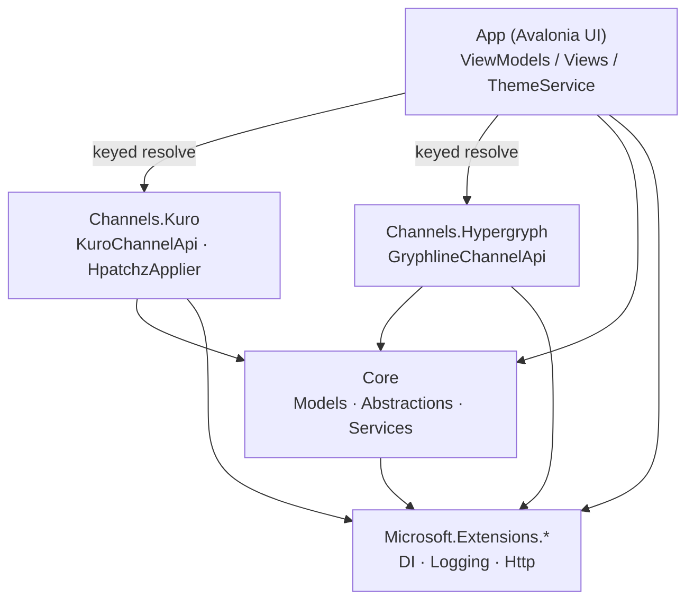
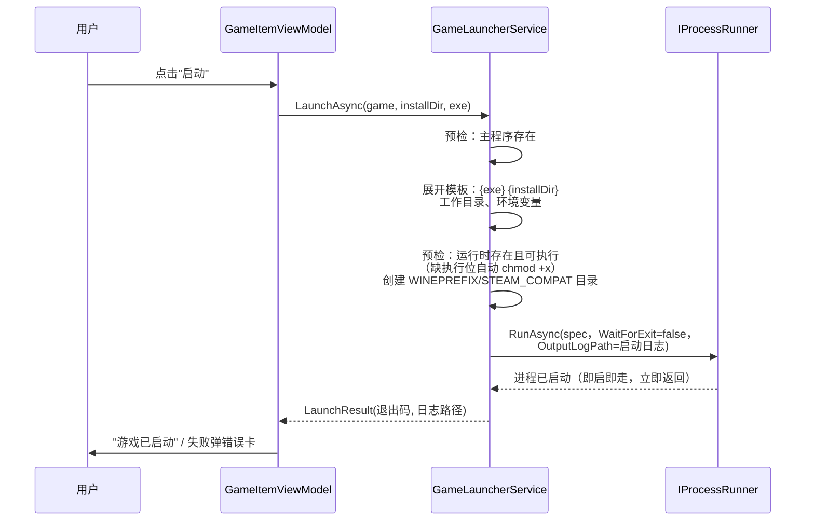
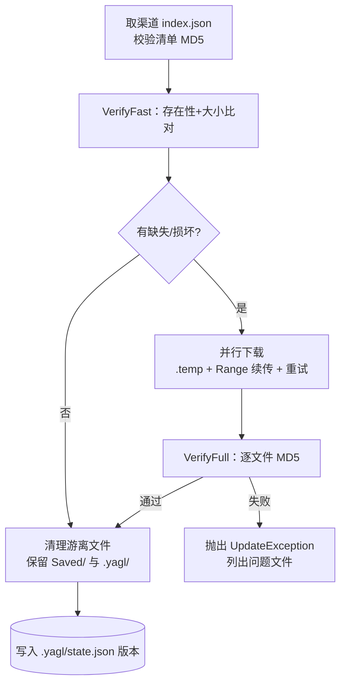
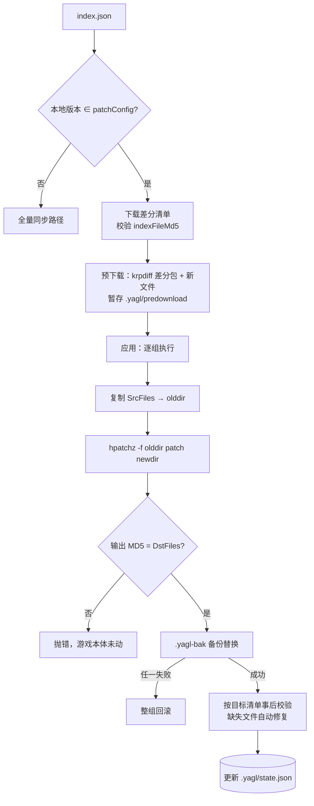
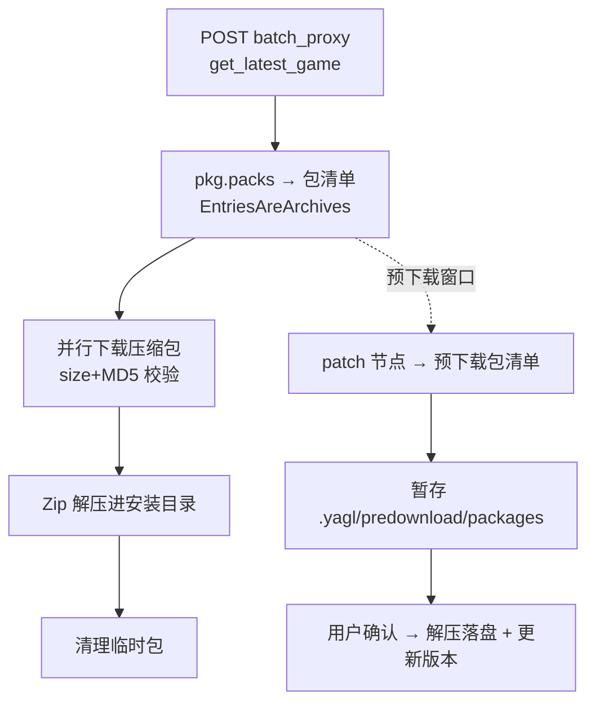
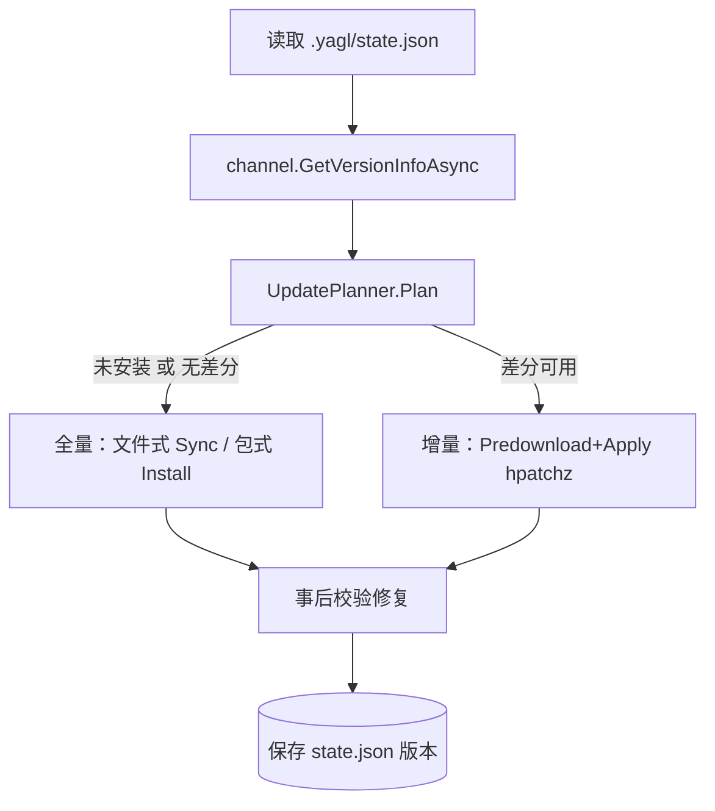
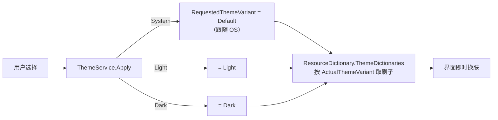

# 架构文档

本文描述 YetAnotherGameLauncher 的分层架构、模块职责与全部核心流程。
配套文档：[DEVELOPMENT.md](DEVELOPMENT.md)（开发流程）、[GAME_CONFIG.md](GAME_CONFIG.md)（配置参考）。

## 1. 分层总览

```
┌─────────────────────────────────────────────────────┐
│                 YetAnotherGameLauncher (App)         │
│   Avalonia 12 UI · MVVM · 主题 · DI 组合根           │
│   Views ←→ ViewModels (CommunityToolkit.Mvvm)        │
└───────────────┬─────────────────────────────────────┘
                │ 依赖抽象（IGameChannelApi / IDownloader / …）
┌───────────────┴─────────────────────────────────────┐
│        Channels.Kuro        │  Channels.Hypergryph   │
│  库洛协议（鸣潮）            │  GRYPHLINE 协议（终末地）│
│  index.json/indexFile 解析  │  batch_proxy 整包协议   │
│  CDN 选择 · URL 拼接        │  版本/包清单 → 包式清单  │
│  HpatchzApplier（HDiffPatch）│                        │
└───────────────┬─────────────────────────────────────┘
                │
┌───────────────┴─────────────────────────────────────┐
│                 YetAnotherGameLauncher.Core          │
│  Models（配置/清单/进度/状态）                        │
│  Abstractions（IGameChannelApi/IDownloader/…）        │
│  Services（目录/下载/校验/同步/增量/包式/编排/启动）   │
│  Utilities（Hashing/Json/FileUtilities）              │
│  根目录单文件：InstallPath / AppPaths                 │
│  零 UI 依赖、零厂商依赖                               │
└─────────────────────────────────────────────────────┘
```

依赖方向严格单向：**App → Channels → Core**。渠道以 DI keyed service 注册
（键即 `games.json` 中 `game.channel`），新增渠道不需要改动 Core 与已有渠道。
操作系统差异同理：`IPlatformInfo`、`IAutostartService` 等平台抽象由组合根
按当前操作系统注入 Windows/Linux 实现，业务代码只依赖接口。

### 模块依赖图



## 2. 关键抽象

| 抽象 | 职责 | 生产实现 | 测试替身 |
|---|---|---|---|
| `IGameChannelApi` | 版本查询 / 全量清单 / 增量清单 / 预下载清单 | `KuroChannelApi`、`GryphlineChannelApi` | `FakeChannel` |
| `IDownloader` | 单文件下载：Range 续传、重试、MD5/size 校验 | `HttpFileDownloader` | `FakeDownloader`、`StubHttpHandler` |
| `IPatchApplier` | 差分合成（目录模式） | `HpatchzApplier`（HDiffPatch） | `FakePatchApplier` |
| `IProcessRunner` | 外部进程（超时/输出捕获） | `SystemProcessRunner` | `FakeProcessRunner` |
| `IPlatformInfo` | OS 判定、GPU 厂商探测（NVIDIA 走 /proc 闭源驱动，AMD/Intel 走 /sys/class/drm 的 PCI vendor；路径可注入）、用文件管理器打开目录 | `WindowsPlatformInfo`、`LinuxPlatformInfo`（DI 按 OS 注入） | `FakePlatformInfo` |
| `IAutostartService` | 开机自启查询/切换（Windows 注册表 / Linux XDG autostart） | `WindowsAutostartService`、`LinuxAutostartService`（DI 按 OS 注册） | 真实现 + FakeProcessRunner（VmFactory 缺省）；集成测试按平台注入真实现 |
| `IBackdropResolver` | 按区域解析详情页背景来源（图/视频 + 首帧海报） | `KuroBackdropResolver`、`EndfieldBackdropResolver`（按渠道键 keyed 注册） | 测试内联假实现 |
| `GameCatalogService` | games.json 加载/校验/原子保存 | — | 配置 fixture |
| `GameInstallService` | 全量同步（校验→并行下载→事后校验→清理） | — | 假下载器 |
| `IncrementalUpdateService` | 差分两段式（暂存→应用/回滚） | — | 假补丁器 |
| `PackageInstallerService` | 包式两段式（下载→解压） | — | 假下载器 |
| `GameUpdateService` | 面向 UI 的编排入口 | — | 全假组件 |
| `GameLauncherService` | 命令模板解析与启动 | — | `FakeProcessRunner` |
| `ThemeService` | ThemeVariant 三态切换 | — | — |

两类渠道分发模型，由 `GameManifest.EntriesAreArchives` 区分：

- **文件式（鸣潮）**：清单 = 最终游戏文件（path/size/md5），差分入口 `patchConfig` 按旧版本号精确匹配。
  index.json 是双块结构：live→live 的差分入口在 `default` 块、预下载（live→predownload）的差分入口在
  `predownload` 块——`GetIncrementalManifestAsync` 按目标版本选块（2026-09-20 修复：此前只查 default 块，
  预下载窗口期必失败）。预下载可用性 = `predownloadSwitch` 开启且 predownload 块带 `config`。
- **包式（终末地）**：清单 = 压缩包（packs），下载解压即安装；无按版本差分，更新=请求新版本整包，预下载=响应 `patch` 节点。

## 3. 核心流程

### 3.1 启动游戏



启动是**即启即走**（fire-and-forget）：`ProcessStartSpec.WaitForExit = false`，
启动器不等待游戏退出、不杀进程树。游戏 stdout/stderr 经输出泵写入
`~/.local/share/yagl/logs/launch-<游戏id>-<时间戳>.log`（逐行读取到 EOF——
不用 `BeginOutputReadLine` 事件：`WaitForExit()` 只排空 stdout，stderr 会丢；
日志路径模式的进程句柄在泵收尾后才释放，`using` 作用域提前 Dispose 会掐断管道）。
游戏秒退的排查线索由日志尾注 + 应用日志共同记录：退出码与存活时长。

**预检**（`BuildPlan` 内）：① 主程序存在（`ExecutableMissing`）；② 模板首段可执行——
裸命令名按 PATH 解析（找不到 → `RuntimeMissing`），绝对路径缺执行位自动补
`chmod +x`（从压缩包解出的 proton 脚本常见，补不上 → `RuntimeNotExecutable`）；
③ `WINEPREFIX` / `STEAM_COMPAT_DATA_PATH` 目录创建（Proton 要求已存在，
失败 → `PrefixCreateFailed`）。失败抛 `LaunchException`（`UpdateException` 子类，
携带 `LaunchFailureKind` 与日志路径），UI 据此弹主题化错误覆盖层：
类目化中文原因 + 可折叠技术详情 + 打开日志目录。

Windows 上若游戏可执行文件的清单要求管理员权限（requireAdministrator），
`CreateProcess` 抛 Win32Exception 740（ERROR_ELEVATION_REQUIRED，无法自提升）：
`SystemProcessRunner` 换用 `UseShellExecute = true` 的全新 `ProcessStartInfo`
经 ShellExecute 启动，由系统弹 UAC；该路径不支持按进程注入环境变量，
配置了自定义环境时记警告放弃。

命令模板支持引号包裹（含空格路径），例如 `wine "{exe}"`；
Linux 上如何运行（umu / 直接运行）完全由配置决定，代码零平台假设。
设置页启动方式二选一：**umu 启动**（默认，`native-umu {exe}`）与**直接运行**（`{exe}`，Windows 唯一方式）；
旧版 wine/Proton 模板仍可执行（裸命令名走通用 PATH 语义），仅不再出现在选择器中；
存量 `umu-run {exe}` 模板由 `schemaVersion 5` 一次性迁移升级为推荐链（`MigrateLinuxLegacyUmuTemplatesAsync`）——
外部 umu-launcher 代码已整体移除，手写自定义模板不受影响。
umu 模式旁有 **Proton 发行版选择**（DW-Proton / GE-Proton / UMU-Proton，默认 DW-Proton）：
代号写入 `environment.PROTONPATH` 并即时保存，启动解析与组件准备共用它
（`CompatTools.ResolveNativeProtonRequest` 优先读 PROTONPATH，空配置兜底 DW-Proton——绝不回退 UMU-Proton）。
代号语义 = 只下载所选发行版：本地已装该前缀最新且**架构相符**（wineserver ELF 判定）即直接用
（启动/组件准备不联网、不静默更新），缺失或已装为错架构才按代号拉对应仓库 latest（自愈重装）；
版本更新由设置页"检查更新"按钮显式触发
（`FetchLatestProtonTagAsync` 查上游 tag，确认后 `UpdateProtonAsync` 装新版并清理同发行版旧目录）。
UMU_ID 由 `launch.umuId` 覆盖（对齐 umu 数据库规范 ID：鸣潮 `umu-3513350`、终末地 `umu-endfield`）。
推荐链单一事实源在 `CompatTools.BuildRecommendedLaunch`（默认原生 umu）。原生链在
`NativeUmuLauncher` + `IUmuComponentProvisioner`：

1. 解析/下载 Proton（DW-Proton [dawn.wine Forgejo] / GE-Proton / UMU-Proton [GitHub]
   → `~/.local/share/Steam/compatibilitytools.d`；DW 资产 tar.xz 且目录名去架构后缀）。
   资产按**主机架构过滤**（`-x86_64`/`-aarch64` 后缀：优先同架构、次选无后缀、排除反向——
   GitHub 资产顺序即上传顺序，GE-Proton11-6 曾把 aarch64 排在 x86_64 之前），解压后再以
   `files/bin/wineserver` 的 ELF e_machine 兜底校验，架构不符即中止并清理
2. 读 `toolmanifest.vdf` 得所需 Steam Runtime，缺失则下载到 `~/.local/share/umu/<variant>`（SHA256 校验）
3. `UmuPrefix.Setup` 布好 Proton 兼容 prefix（pfx 符号链接、shadercache、steamuser）
4. `UmuEnvironment.Build` 写完整 STEAM_COMPAT_* / UMU_* 环境
   （与上游 umu_run.py 对齐：`STEAM_COMPAT_APP_ID` 恒为 prefix 路径 MD5、`STORE` 缺省空串；
   配置里的 PROTONPATH 代号不覆盖已解析的绝对路径）
5. 经 `{runtime}/_v2-entry-point --verb=… -- {proton}/proton <verb> {exe}` 启动（`IProcessRunner`，即启即走）

外部 `umu-run` zipapp 路径（`UmuLauncherInstaller`）已整体移除；存量模板经 schemaVersion 5 迁移转入原生链。
Wine prefix 统一在 `{数据目录}/yagl/prefixes/<游戏id>`（`STEAM_COMPAT_DATA_PATH` 同址），
绝不写入游戏安装目录——安装同步的清单外清理不会误删 prefix（`compatdata` 另在保留名单纵深防御）。
（唯一例外是首运配置生成：Linux 会把默认 `{exe}` 升级为推荐链再落盘，见 GAME_CONFIG.md。）

### 3.2 全量同步（文件式）



### 3.3 增量更新（鸣潮 krpdiff，两段式）



要点（与参考实现 wutheringwaves-cli-manager 对齐）：

- 差分入口按**字符串精确匹配**本地版本；
- 单组失败只回滚该组（已成功的组保留），整体可重试直至成功；
- 中断后可重复"应用"：目标文件已就绪的组自动跳过；
- 事后校验使用目标版本全量清单，缺失文件走全量修复路径。

### 3.4 包式安装/预下载（终末地）



### 3.5 更新编排（GameUpdateService）



### 3.6 主题切换



`Apply` 可从任意线程调用（后台初始化场景）：跨线程时经 `Dispatcher.Post` 投递。

### 3.7 背景视频播放子系统

详情页背景的解析、缓存与视频播放管线：配置文件不携带背景地址，缓存元数据记录抓取时的区域与
游戏版本，两者均未变化时直接用缓存（零网络），版本更新后的首次解析才向渠道确认当期背景；
缓存到本地后由 FFmpeg 播放器后台解码上屏，并以循环点分析 + 预卷做到无缝循环。关键机制：

- **背景解析**：keyed `IBackdropResolver` 按渠道解析——
  `kuro`：官方运营配置直连两跳——launcher-config 的 `functionCode.background` 取当期投放哈希，
  再取背景内容 JSON 的 `backgroundFile`/`firstFrameImage`（背景视频 + 首帧图；按语言投放，主语言
  404 自动回退 en/zh-Hans。2026-09-13 实测：历史端点 switch.json 已停止投放背景，官方改哈希寻址）；
  `hypergryph`：官方启动器 `get_main_bg_image` 接口（视频优先、静态图兜底）。
  两渠道一致的单级回退模型：视频不可用时首帧/静态图兜底，解析失败返回 null 交上层处理，不再探测
  本机官方启动器缓存或本地帧序列。
  `GameBackdropService` 把远程背景流式下载缓存到 `%ConfigDirectory%/backdrops/<gameId>/`
  （`backdrop.*` + `poster.*` + `meta.json`），地址未变不重复下载，离线/下载失败回退上次缓存。
  **版本门控**（产品决策：背景严格跟随游戏版本，卡池轮换等与版本无关的运营投放不触发刷新）：
  `meta.json` 记录 `region`/`gameVersion`，`ResolveAsync(request, gameVersion)` 在区域与版本均未变化、
  文件在盘时直接返回缓存、不调解析器；版本变化后的解析若地址未变则仅升级元数据不重下。
  `ResolveCachedAsync` 纯磁盘读取（启动预加载用），`GetCachedGameVersion` 供 VM 免网络对齐资产版本。
- **启动资产预热与一次性版本检测**（`MainWindowViewModel.WarmupGames` + `GameItemViewModel`）：
  启动时全部游戏并行 `PreloadAssetsAsync`（图标 + 背景仅读磁盘缓存）让侧栏图标即刻可见；
  每游戏每启动一次 `GetVersionInfoAsync`（`GameItemViewModel` 按 SelectedServer 会话缓存，
  选中/切语言/操作完成后的刷新不再打网络；测试经 `ResetVersionCheckCache` 模拟重启），
  版本检测成功且与资产缓存记录版本不一致时才重新解析背景并重取 http 图标。
  图标 URL 缓存于 `%ConfigDirectory%/image-cache/`（`BackgroundImageService`，URL SHA256 键；
  `ReloadAsync` 绕过缓存强制重取）。区域随界面语言（cn/global），语言切换换区时重新解析新区域。
  离线启动状态行照常提示无连接，资产由缓存兜底。
- **播放**：`FfmpegVideoBackdropPlayer` 后台线程解码（Windows D3D11VA / Linux VAAPI→CUDA(NVDEC)
  硬解，按序尝试、设备创建失败自动落到下一项直至回软解；硬解 GPU 帧经 `av_hwframe_transfer_data`
  回读系统内存——回读不拷贝帧属性，pts 必须在回读前从原始解码帧捕获），swscale 转 BGRA 后逐行 blit 进
  `WriteableBitmap`，16ms 节流通知 UI 重绘；`PlaybackClock` 按 PTS 实时节拍
  （落后超阈值重定基线，不做爆发追帧），渲染尺寸 clamp ≤4K（防呆上限：官方投放原样渲染不降采样，
  2026-09 实测投放最高 2324×1392；解码本就按源分辨率全量进行，clamp 只作用于 swscale 输出目标），
  静音不解码音轨。
  硬解日志语义：设备创建成功/失败（含 `av_strerror` 错误文本）各一条，`avcodec_open2` 后再打一条
  协商出的分辨率与像素格式（`2324x1392 vaapi_vld (hardware)` / `2048x1216 yuv420p (software)`）——设备创建成功 ≠ 硬解生效，
  协商格式才是判据；循环点分析源刻意纯软解，不打硬解日志（勿把"软解分析"误读成回退失败）。
- **原生库供给**（`FfmpegLibraryResolver`，与 FFmpeg.AutoGen 9.0 绑定精确配套 = libavcodec 主版本 63）：
  应用数据目录已下载库 → 系统库（Linux 探测 `libavcodec.so.63`——其它主版本 ABI 不配套会崩，宁缺毋滥；
  旧实现拼出 `libavcodec-63.dll`/裸 `dlopen("avcodec")`，Linux 上永远失败，是"背景视频没了"的根因）→
  下载 BtbN LGPL 共享构建（SHA256 校验后解压到 `%ConfigDirectory%/ffmpeg/<rid>/`）。
- **无缝循环**：`SeamAnalyzer` 把头/尾各约 2s 的帧缩为 64×36 灰度缩略，搜索帧对平均绝对差最小的
  循环点，阈值内命中则循环从该点起播（起播不 seek，从流头顺序读取、渲染前丢弃起点之前的帧）；
  临近循环终点前 2s 由第二个解码源后台预解码下一循环开头 10 帧，经 `PrerollHandoff` 交接状态机
  交接，到达终点时预卷源整体收编、先消费预解码帧，零间隙续播；收编时按接缝差自适应——
  差值在阈值内直接硬化切，否则 0.6s 交叉淡化。预卷未就绪回退为重开全新解码源 + 交叉淡化。
- **退出与解码失败韧性**：窗口 Closing / 程序性 `ShutdownRequested` 都会先停播放再进入平台拆除——
  退出期 GPU 解码栈可能失效（2026-09 实测：NVIDIA + nvidia-vaapi-driver，点 X 退出时 VAAPI/CUDA
  全部初始化失败），解码循环若继续运行会以每帧两条的速度向 stderr 刷
  "hardware accelerator failed to decode picture"。运行期另有 `DecodeGuard` 两级熔断（纯状态机，
  决策表单测）：单路解码源连续 32 个视频包无输出帧（正常 h264 B 帧重排深度上限 16）判坏死放弃；
  重开/收编后的解码源仍未产出有效回（≥0.25s 且 ≥8 帧）连续 3 次即停止播放——帧位图清空后
  `FrameSurface` 不绘制，静态海报自然兜底，下次进详情页重新起播可自愈。
  **停止即清帧**：`Stop`（切游戏/退出/窗口关闭共用；切非游戏页走暂停保活，不在此列）取消循环、
  推进代际并清空帧缓冲——共享单例播放器
  切换游戏时，上一游戏最后一帧的迟到通知（解码线程经 UI 线程 Dispatcher 异步投递）以空帧缓冲为证
  不再点亮新页面（`GameItemViewModel` 以 `Frame` 非空为准），否则新详情页会短暂显示上一游戏的画面；
  旧循环另受代际门双重约束：`PresentFrame` 过门后方可渲染，`RenderFrame` 在位图拷入后复查代际，
  失配即整帧丢弃、不投递通知（旧画面无从复活；清帧由 Stop 的 `ClearFrame` 在锁内完成）——过门后的
  PTS 等待/sws/拷贝窗口内发生的 `Stop` 也不会让旧画面点亮新页面。
- **起播与停止的生命周期（2026-09-20 复审补齐）**：播放器侧 `PlayAsync` 收尾先摘共享 `_cts` 引用
  再释放（自然结束路径不经 Cancel，悬挂已释放实例曾是隐患；.NET 10 起 Cancel-on-disposed 为 no-op
  不抛，防御性 try/catch 留作语义显式化）；VM 侧 `StartVideoAsync` 以起播代际标记——起播窗口内被
  后发起播抢先的旧调用失败时不再执行 VM 级 StopVideo 清场（否则会误杀新一代起播，视频层不再
  点亮直到离页再进），只有最新一次起播有权清理。
- **切页暂停保活（2026-09-21）**：`MainWindowViewModel.OnCurrentPageChanged` 驱动三态——
  切到**另一游戏页** = 旧页全停换源（"停止即清帧"契约原样）；切到**非游戏页**（设置/关于/抽卡/游戏设置）
  = `SuspendVideo` 暂停（`IVideoBackdropPlayer.Pause` 把解码线程泊车在帧处理点，帧缓冲/解码源/订阅
  原样保留，`HasBackgroundVideo` 不翻——页外不占解码资源但不付重启成本）；**重进同一游戏页** =
  续播快路径（会话存活且已订阅时直接 `Resume`，无 500ms 起播延迟、不重开解码源/不重新分析循环点；
  `FrameSurface` 重挂视觉树即画暂停帧）。播放器侧续播经 `ManualResetEventSlim` 门与取消令牌
  `WaitAny`——暂停中 `Stop` 靠取消令牌正常唤醒退出，醒来重定 `PlaybackClock` 基线（暂停时长不计入
  时间轴）；无会话时 `Pause` 为 no-op（不得留下复位门，新会话启动时 `Set` 另有兜底）。
  `StartVideoAsync` 的起播延迟窗口内离页（无论全停还是暂停）放弃起播，不在页外隐形解码。
- **关键约束**：本机 BtbN FFmpeg n9.0 构建的 mov demuxer 上 seek 不可靠——
  所有路径一律顺序读取 + 帧丢弃对齐，禁止带时间戳的 seek。

## 4. 配置与状态的数据流

- **配置（输入）**：`games.json`（渠道键、服务器选项、启动模板）→ `GameCatalogService` 解析 + 全量语义校验（错误集中返回）。
- **状态（输出）**：`{installDir}/.yagl/state.json`（gameId/serverId/Version，防错配）；预下载暂存 `.yagl/predownload/`（含 `manifest.json`，应用阶段读取）。
- **不修改**官方启动器的兼容文件（如 `launcherDownloadConfig.json`、`Saved/` 存档目录在清理时保留）。

## 5. 线程模型

- ViewModel 命令在 UI 线程触发，网络/磁盘在任务池并行（`Parallel.ForEachAsync`，并行度为内部选项 `GameInstallServiceOptions.MaxParallelFiles`，默认 8，不作为用户配置项开放）。
- 进度经 `Progress<T>` 回传（捕获同步上下文），聚合计数用 `Interlocked`/锁。
- `HttpFileDownloader` 内部自管理 `.temp` 文件，多文件并发互不相交。

## 6. 安全设计

- 清单路径经 `ManifestVerifier.ResolveSafe` 越界检查（拒绝 `..`、绝对路径、盘符）。
- 所有从 CDN 下载的字节按 `size`+`MD5` 校验后才落位（`index.json` 清单本身也校验 `indexFileMd5`）。
- 差分输出先校验再替换；替换带备份回滚，任何失败不破坏既有安装。
- GRYPHLINE 协议字段来自社区逆向，已隔离在渠道项目内并可配置 `apiBase`。
