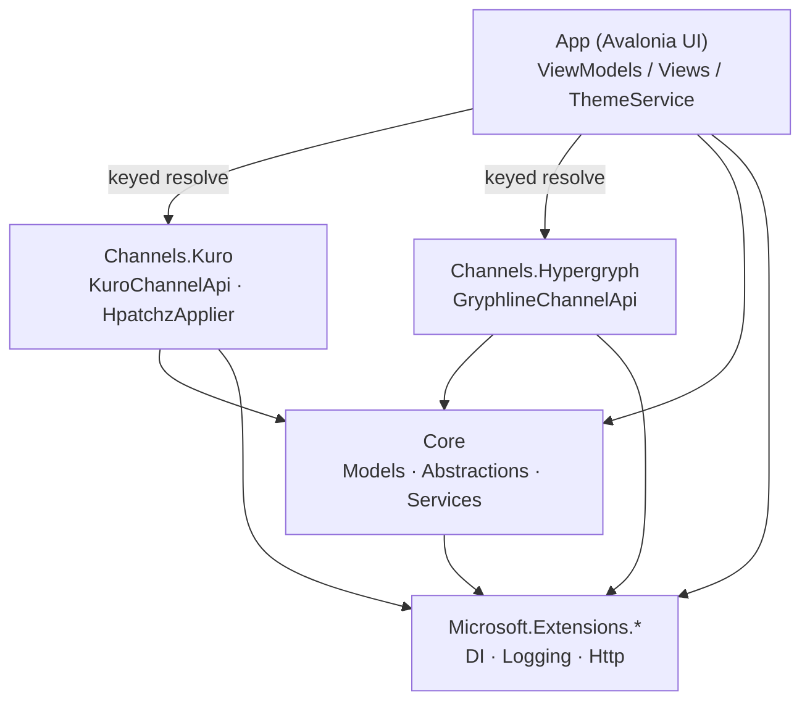
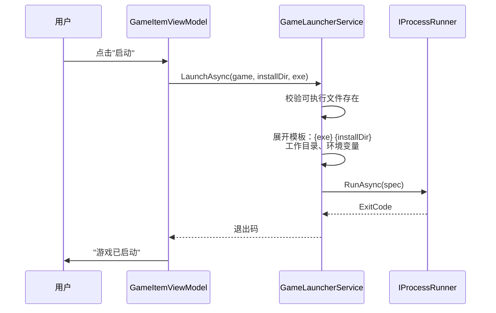
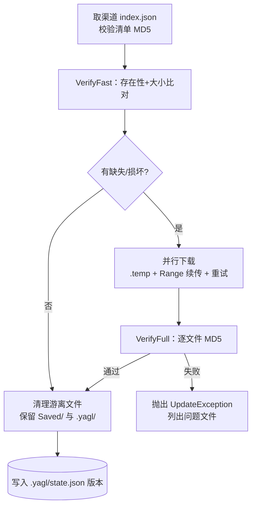
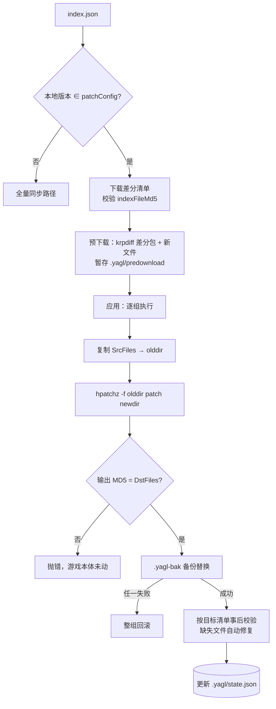
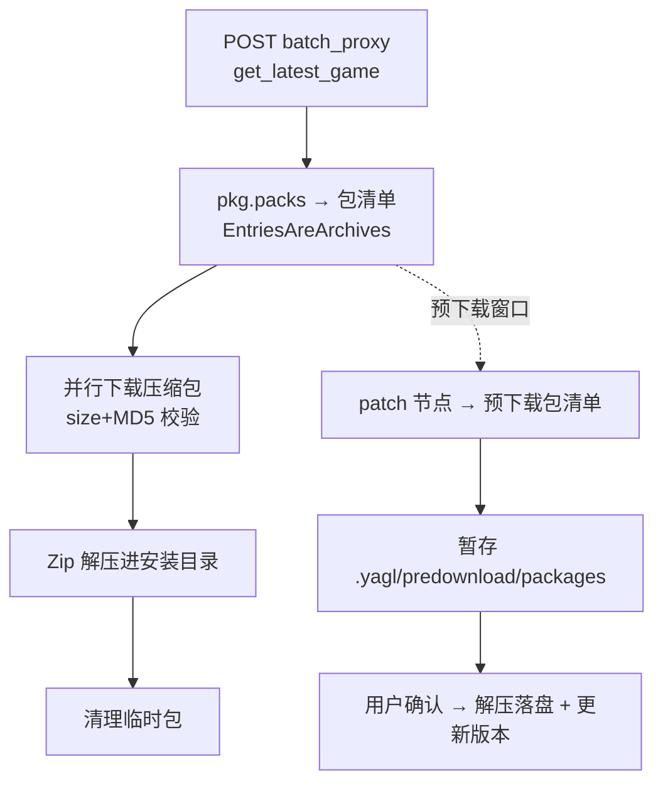
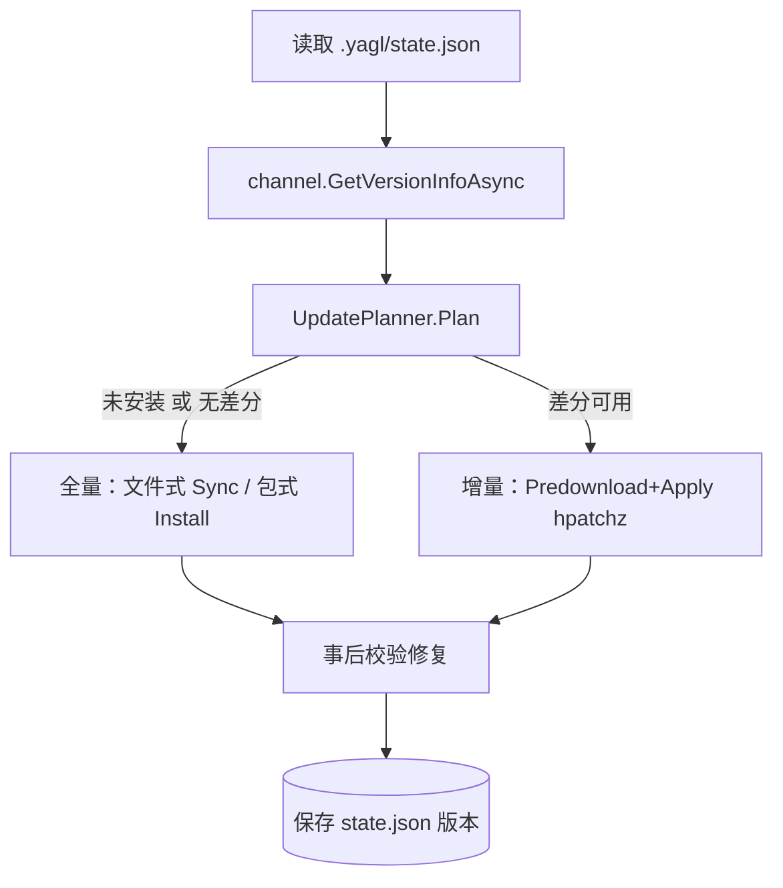
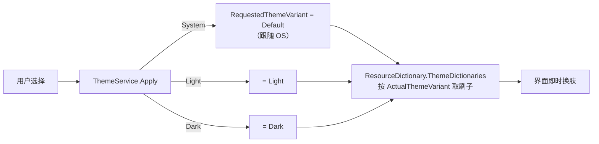

# 架构文档

本文描述 YetAnotherGameLauncher 的分层架构、模块职责与全部核心流程。
配套文档：[DEVELOPMENT.md](DEVELOPMENT.md)（开发流程）、[GAME_CONFIG.md](GAME_CONFIG.md)（配置参考）。

## 1. 分层总览

```
┌─────────────────────────────────────────────────────┐
│                 YetAnotherGameLauncher (App)         │
│   Avalonia 12 UI · MVVM · 主题 · DI 组合根           │
│   Views ←→ ViewModels (CommunityToolkit.Mvvm)        │
└───────────────┬─────────────────────────────────────┘
                │ 依赖抽象（IGameChannelApi / IDownloader / …）
┌───────────────┴─────────────────────────────────────┐
│        Channels.Kuro        │  Channels.Hypergryph   │
│  库洛协议（鸣潮）            │  GRYPHLINE 协议（终末地）│
│  index.json/indexFile 解析  │  batch_proxy 整包协议   │
│  CDN 选择 · URL 拼接        │  版本/包清单 → 包式清单  │
│  HpatchzApplier（HDiffPatch）│                        │
└───────────────┬─────────────────────────────────────┘
                │
┌───────────────┴─────────────────────────────────────┐
│                 YetAnotherGameLauncher.Core          │
│  Models（配置/清单/进度/状态）                        │
│  Abstractions（IGameChannelApi/IDownloader/…）        │
│  Services（目录/下载/校验/同步/增量/包式/编排/启动）   │
│  Utilities（Hashing/Json/InstallPath）                │
│  零 UI 依赖、零厂商依赖                               │
└─────────────────────────────────────────────────────┘
```

依赖方向严格单向：**App → Channels → Core**。渠道以 DI keyed service 注册
（键即 `games.json` 中 `game.channel`），新增渠道不需要改动 Core 与已有渠道。

### 模块依赖图



## 2. 关键抽象

| 抽象 | 职责 | 生产实现 | 测试替身 |
|---|---|---|---|
| `IGameChannelApi` | 版本查询 / 全量清单 / 增量清单 / 预下载清单 | `KuroChannelApi`、`GryphlineChannelApi` | `FakeChannel` |
| `IDownloader` | 单文件下载：Range 续传、重试、MD5/size 校验 | `HttpFileDownloader` | `FakeDownloader`、`StubHttpHandler` |
| `IPatchApplier` | 差分合成（目录模式） | `HpatchzApplier`（HDiffPatch） | `FakePatchApplier` |
| `IProcessRunner` | 外部进程（超时/输出捕获） | `SystemProcessRunner` | `FakeProcessRunner` |
| `GameCatalogService` | games.json 加载/校验/原子保存 | — | 配置 fixture |
| `GameInstallService` | 全量同步（校验→并行下载→事后校验→清理） | — | 假下载器 |
| `IncrementalUpdateService` | 差分两段式（暂存→应用/回滚） | — | 假补丁器 |
| `PackageInstallerService` | 包式两段式（下载→解压） | — | 假下载器 |
| `GameUpdateService` | 面向 UI 的编排入口 | — | 全假组件 |
| `GameLauncherService` | 命令模板解析与启动 | — | `FakeProcessRunner` |
| `ThemeService` | ThemeVariant 三态切换 | — | — |

两类渠道分发模型，由 `GameManifest.EntriesAreArchives` 区分：

- **文件式（鸣潮）**：清单 = 最终游戏文件（path/size/md5），差分入口 `patchConfig` 按旧版本号精确匹配。
- **包式（终末地）**：清单 = 压缩包（packs），下载解压即安装；无按版本差分，更新=请求新版本整包，预下载=响应 `patch` 节点。

## 3. 核心流程

### 3.1 启动游戏



命令模板支持引号包裹（含空格路径），例如 `wine "{exe}"`；
Linux 上如何运行（原生/wine/Proton/steam）完全由配置决定，代码零平台假设。

### 3.2 全量同步（文件式）



### 3.3 增量更新（鸣潮 krpdiff，两段式）



要点（与参考实现 wutheringwaves-cli-manager 对齐）：

- 差分入口按**字符串精确匹配**本地版本；
- 单组失败只回滚该组（已成功的组保留），整体可重试直至成功；
- 中断后可重复"应用"：目标文件已就绪的组自动跳过；
- 事后校验使用目标版本全量清单，缺失文件走全量修复路径。

### 3.4 包式安装/预下载（终末地）



### 3.5 更新编排（GameUpdateService）



### 3.6 主题切换



`Apply` 可从任意线程调用（后台初始化场景）：跨线程时经 `Dispatcher.Post` 投递。

## 4. 配置与状态的数据流

- **配置（输入）**：`games.json`（渠道键、服务器选项、启动模板）→ `GameCatalogService` 解析 + 全量语义校验（错误集中返回）。
- **状态（输出）**：`{installDir}/.yagl/state.json`（gameId/serverId/Version，防错配）；预下载暂存 `.yagl/predownload/`（含 `manifest.json`，应用阶段读取）。
- **不修改**官方启动器的兼容文件（如 `launcherDownloadConfig.json`、`Saved/` 存档目录在清理时保留）。

## 5. 线程模型

- ViewModel 命令在 UI 线程触发，网络/磁盘在任务池并行（`Parallel.ForEachAsync`，上限 `maxParallelDownloads`）。
- 进度经 `Progress<T>` 回传（捕获同步上下文），聚合计数用 `Interlocked`/锁。
- `HttpFileDownloader` 内部自管理 `.temp` 文件，多文件并发互不相交。

## 6. 安全设计

- 清单路径经 `ManifestVerifier.ResolveSafe` 越界检查（拒绝 `..`、绝对路径、盘符）。
- 所有从 CDN 下载的字节按 `size`+`MD5` 校验后才落位（`index.json` 清单本身也校验 `indexFileMd5`）。
- 差分输出先校验再替换；替换带备份回滚，任何失败不破坏既有安装。
- GRYPHLINE 协议字段来自社区逆向，已隔离在渠道项目内并可配置 `apiBase`。
